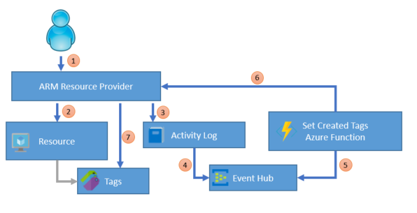

# Azure Set Created Tags
An Azure solution that uses Event Hubs and Azure Functions to set tags on resources that indicate when and by whom they were created or updated.

## Introduction
When you're managing an Azure subscription, it can be very useful to know which resources were
created by which user, when they were created, when they were updated, etc. Unfortunately Azure
doesn't currently make that information readily available--you need to find it by digging into the Activity Logs, which generally isn't a practical thing to do manually. This repo provides a solution by processing Activity Log entries as they arrive, and updating the Tags of the resources based on the information in the log. The Tags created by this solution are:

- **CreatedBy**: The User Principal Name or App ID of the account that created the resource. The solution will write this tag whenever it doesn't already exist, so if the resource existed before this solution was deployed it will show the next user to change the resource.
- **CreatedDate**: The date/time the resource was created, in ISO8601/UTC format. As with CreatedBy, this tag is written if it doesn't already exist.
- **ModifiedBy**: The User Principal Name or App ID of the account that last modified the resource. This tag is written every time the resource is modified.
- **ModifiedDate**: The date/time the resource was last modified, in ISO8601/UTC format. This tag is written every time the resource is modified.

## How it works

1. A user creates an Azure resource by submitting a request to an ARM Resource Provider, 
e.g. using the portal, the command line or an ARM template.
2. The Resource Provider creates the Azure resource as requested.
3. The Resource Provider also writes an entry to the Azure Activity Log showing the change that
was made.
4. The Azure Activity Log is configured to exports all events to an Event Hub
5. A Azure Function is configured to be activated when events are available on the Event Hub
6. The Azure Function calls the Resource Provider and requests that the Created and/or Updated
tags be updated with the information from the Activity Log.
7. The Resource Provider writes the tags onto the resource.

## How to run
1. Ensure you have a valid Azure subscription and log onto the Portal
1. Go to Azure Active Directory / App Registrations and create a new "Web App / API" registration. Then create a Key. Make a note of the App ID, Secret Key as well as the AAD Tenant ID (found under Properties). The Function will use these details to update the tags on the resources.
1. Go to Subscriptions / <Your Subscription> / Access Control, and grant your new AAD application
"Contributor" access to the subscription.
1. Create a new Event Hub, which will receive the Activity Log events.
1. Open the Activity Log, choose Export and configure it to export all events to the Event Hub you created
1. Create a new Azure Function app, which will respond to the events and update the resource tags.
1. Clone the Git repo and open it in Visual Studio 2017 (15.3 or later with Azure Functions Tools installed)
1. Update the values in **local.settings.json** with the values:
    1. **AzureWebJobsStorage** and **AzureWebJobsDashboard** must be set to an Azure Storage connection string to be used by the Function
    1. **insights-operational-logs_EVENTHUB** must be set to an Event Hubs connection string with a shared access key with Receive permissions
    1. **SubscriptionId** must be set to the subscription ID for the current Azure subscription
    1. **ClientId**, **ClientSecret** and **TenantId** must be set to the AAD details you noted earlier.
1. Run the function in Visual Studio and confirm it updates tags as Azure resources are created or modified.
1. When it's all working, modify the Application Settings in the Function app to include the matching values for
**insights-operational-logs_EVENTHUB**, **SubscriptionId**, **ClientId**, **ClientSecret** and **TenantId** 
1. Finally, publish the code to your Azure Function app